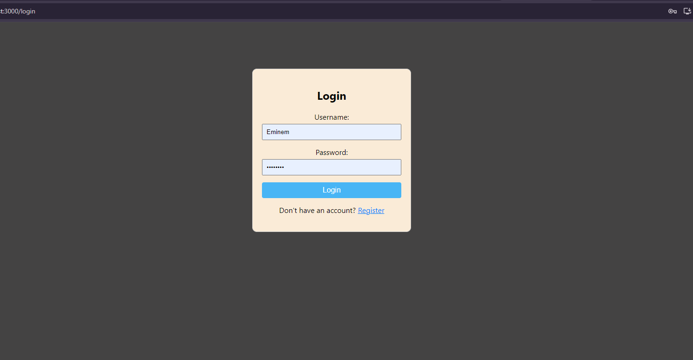
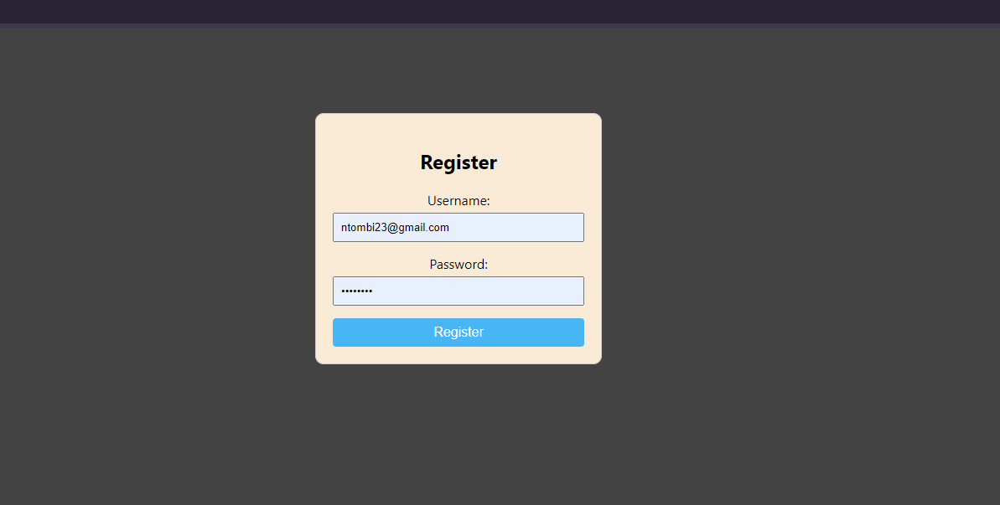
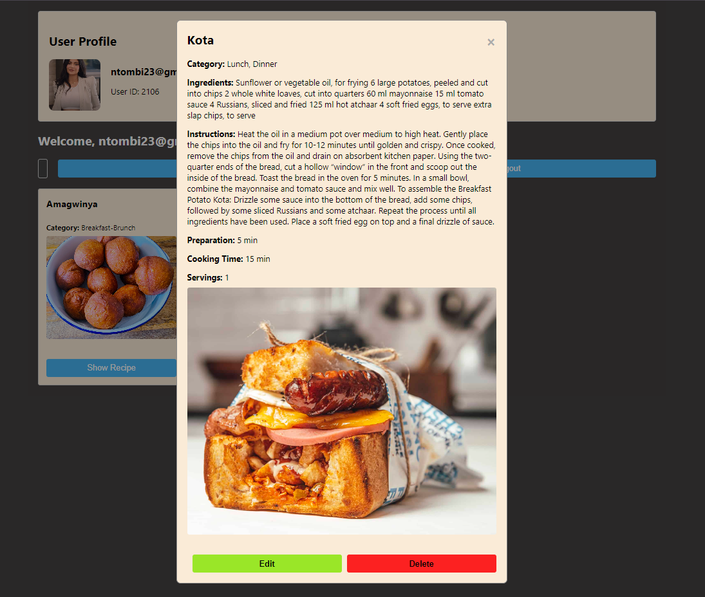
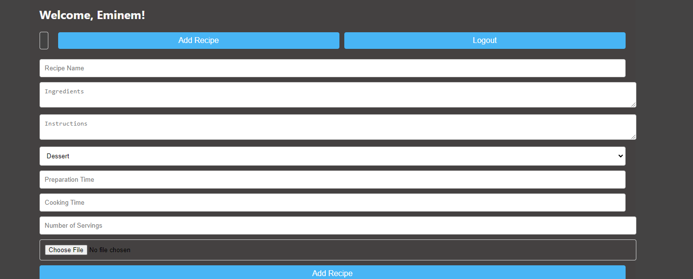
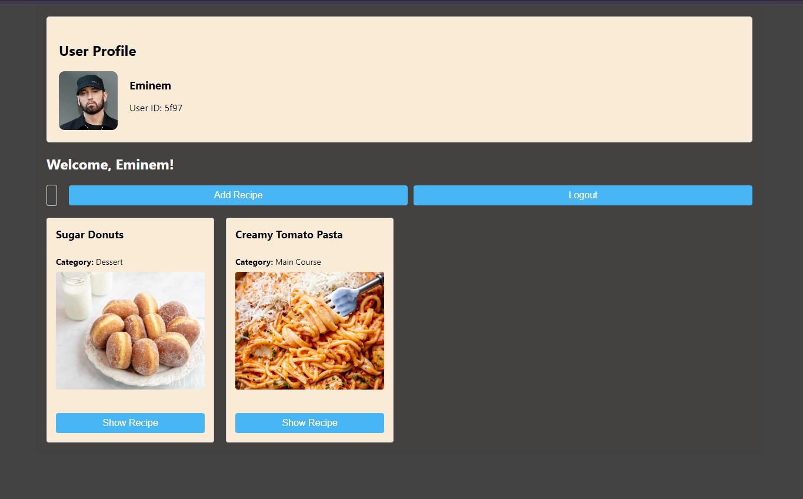

# Online Recipe Application

## Objective
Build an application using React.js and JSON server that allows users to store, manage, and refer to their favorite dishes as recipes.

## Features
- **User Authentication**: Users can register and log in.
- **CRUD Operations**: Create, Read, Update, and Delete recipes.
- **Search Function**: Users can search for recipes by keyword.
- **Responsive Design**: Ensures the application is user-friendly across devices.

## Data Structure
- **Id**: integer
- **Name**: string
- **Ingredients**: array of strings
- **Instructions**: string or array of step-by-step instructions
- **Picture**: string pointing to the image location
- **Category**: string (e.g., Dessert, Main Course, Appetizer)
- **Preparation Time**: string
- **Cooking Time**: string
- **Servings**: integer

## Endpoints
- **GET** `/recipes`: Fetch all recipes
- **POST** `/recipes`: Add a new recipe
- **DELETE** `/recipes/:id`: Remove an existing recipe
- **PATCH** `/recipes/:id`: Update an existing recipe

## Pages
### 1. Login Page
Users can log in with their credentials.


### 2. Registration Page
New users can register with their details.


### 3. Home Page
Displays the list of recipes with options to add, delete, or edit.




## Technologies Used
- **Frontend**: React.js
- **Backend**: JSON Server
- **HTTP Client**: Axios (for making API requests)
- **State Management**: React Context
- **Styling**: CSS or a UI framework 

## Installation
1. Clone the repository:
   ```bash
   git clone https://github.com/Cornel-MIT/Recipe-App.git

2. Navigate to the project directory:
   ```bash
   cd Recipe-App

3. Install dependencies:
   ```bash
   npm install

4. Start the JSON server:
   ```bash
   json-server --watch db.json --port 5000
         
4. Start the React application:
   ```bash
   npm start

4. Domain:
   ```bash
   https://recipe-app-seven-ruddy.vercel.app/  


## Images



## Future Enhancements
- **User Profiles**: Allow users to create profiles to save their favorite recipes and view their recipe history.
- **Recipe Rating System**: Implement a rating system for users to rate recipes and provide feedback.
- **Advanced Search Filters**: Add filters for categories, preparation time, dietary restrictions, etc.
- **Image Upload**: Allow users to upload their own images for recipes instead of using URLs.
- **Meal Planning Feature**: Introduce functionality for users to plan meals for the week and generate shopping lists.
- **Recipe Sharing**: Enable users to share recipes with friends via social media or direct links.
- **Improved UI/UX**: Enhance the user interface with animations and better layout design for improved user experience.
- **Dark Mode**: Implement a dark mode toggle for user preference.
- **Notifications**: Introduce notifications for new recipes, comments, or updates.

